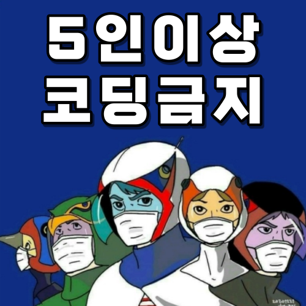
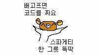
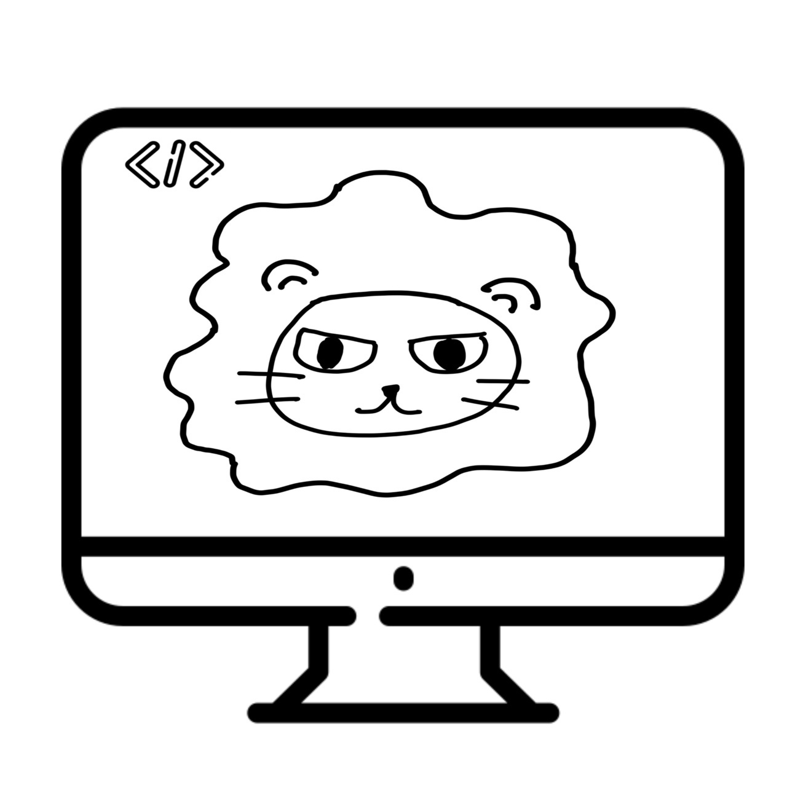

# AI School - 13회차
* 첫번째 발걸음 - 파일럿 프로젝트
  * 내용 : 나의 힘으로 웹에서 데이터를 가져와보자.

    파이썬@ 
       <a href='https://www.facebook.com/dongjo.lim.7'>LDJ</a>
    , [임동조](frontierlim13@gmail.com)

<h2><b>데이터 사이언티스트 실무자</b></h2>

## Notice for Team Project

웹 데이터 수집 파일럿 프로젝트
* 기간 : 2021.09.14(화) 
  * STEP 01. 개인 웹 데이터 수집
    * 최종 분석 제출 : 2021.09.14(화) 22:00
	* 제출 : frontier1020@naver.com
  * STEP 02. 2021.09.15(수), 16(목) 최종 결과물 발표 

## Reference Documents

##  Team Project : Kick Off

- <b>1st Subject </b>: <b>Analyze Social Issues Using BigData </b>
- <b>Our Motto   </b>: <b>Learning by doing, doing by learning !! </b>
- <b>Report Format </b>: <a href="./docu/LikeLion10_프로젝트보고서_포맷_OOO팀.docx">(샘플)보고서 양식</a>
- ※ If you click on the image on the right, you can view "Initiation Report" by team.

<table border=1 bgcolor="#EEEEEE">
	<tr bgcolor="#CC0000">
		<td width="100">
		
<b>Team Name</b>

		</td>
		<td width="100">
		
<b>Team Building</b>

		</td>
		<td width="300">
		
<b>Project Subject</b>

		</td>
		<td width="120">
		
<b>Reports</b>

		</td>
	</tr>
	<tr>
		<td>
        
 팀명:5인이상_코딩금지  (팀장:최두호)  
            <b></b>
		

		</td>
		<td>
            
최두호 김남은, 김민수, 최민혁

        </td>
		<td>
			
 ___ 
</td>
		<td>
            
     
            

        </td>
	</tr>
	<tr>
		<td>
        
 팀명:스파게티 (팀장:김범중)  
            <b></b>
		

		</td>
		<td>
            
김범중 김지연, 정희경 

        </td>
		<td>
			
 ___ 
</td>
		<td>
            
     
            

        </td>
	</tr>
	<tr>
		<td>
        
 팀명:trinity (팀장:김진연)  
            <b></b>
		

		</td>
		<td>
            
김진연 박상엽, 이지은 

        </td>
		<td>
			
  ___ 
</td>
		<td>
            
    
            

        </td>
	</tr>
	<tr>
		<td>
        
 팀명:사자감성  (팀장:문승우)  
            <b></b>
		

		</td>
		<td>
            
문승우  노진희, 조희창 

        </td>
		<td>
			
 ___ 
</td>
		<td>
            
     
            

        </td>
	</tr>
	<tr>
		<td>
        
 팀명:삼삼사자 (팀장:이성준)  
            <b></b>
		

		</td>
		<td>
            
이성준  ___ 

        </td>
		<td>
		    
 ___ 
</td>
		<td>
            
     
            

        </td>
	</tr>

</table>

 
### 멋쟁이 사자처럼 실무 데이터 사이언티스트 1기!  최고 멋진 친구들 버전 화이팅!!! ver3 ^^

##  Team Project : Final Report
- <b>Submission   </b>: 결과보고
- <b>Presentation </b>: 10min / team, Q&A
- <b>Keep in mind </b>: <b> Share Lessons Learned !! </b>

 

 &lt; The End &gt; 

