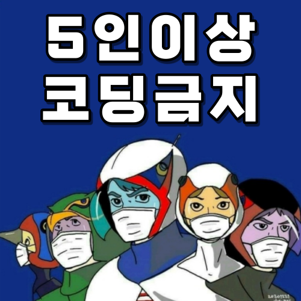
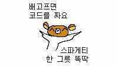

# AI School - 13회차
* 두번째 발걸음 - 팀별 프로젝트
  * 내용 : 팀으로 프로젝트를 수행해 본다.

    파이썬@ 
       <a href='https://www.facebook.com/dongjo.lim.7'>LDJ</a>
    , [임동조](frontierlim13@gmail.com)

<h2><b>멋쟁이 사자처럼 13회-4기</b></h2>

## Notice for Team Project

팀별 프로젝트
* 기간 : 2021.09.17(금) ~ 2021.10.08(금) 
  * STEP 01. 개인 웹 데이터 수집
  * STEP 02. 2021.10.01(금), 중간 발표 
  * STEP 03. 2021.10.08(금), 최종 발표 
    * 최종 분석 제출 : 2021.10.07(목) 22:00
	* 제출 : frontier1020@naver.com

## Reference Documents

##  Team Project : Kick Off

- <b>1st Subject </b>: <b>Analyze Social Issues Using BigData </b>
- <b>Our Motto   </b>: <b> Just Start !! </b>
- <b>Report Format01 </b>: <a href="./docu/최종_프로젝트_수행_계획서_양식.docx">(샘플)프로젝트 수행 계획서 양식</a>
- <b>Report Format02 </b>: <a href="./docu/팀별프로젝트수행_결과작성양식.pptx">(샘플)결과 보고서 양식</a>
- ※ If you click on the image on the right, you can view "Initiation Report" by team.

<table border=1 bgcolor="#EEEEEE">
	<tr bgcolor="#CC0000">
		<td width="100">
		
<b>Team Name</b>

		</td>
		<td width="100">
		
<b>Team Building</b>

		</td>
		<td width="300">
		
<b>Project Subject</b>

		</td>
		<td width="120">
		
<b>Reports A</b>

		</td>
		<td width="120">
		
<b>Reports B</b>

		</td>
	</tr>
	<tr>
		<td>
        
 팀명:5인이상_코딩금지  (팀장:최두호)  
            <b></b>
		

		</td>
		<td>
            
최두호 김은우, 안태현, 강수정

        </td>
		<td>
			
 지역에 따른 전기차 적합여부 
</td>
		<td>
            
 
			
            

        </td>
		<td>
            
 
			<a href="./reports/LikeLion_1차_중간발표_5인이상코딩금지_2101.pdf">중간 발표</a> 
			<a href="./reports/LikeLion_1차_최종_5인이상코딩금지_202110.pdf">최종 작품 보기</a> 
            

        </td>
	</tr>
	<tr>
		<td>
        
 팀명:스파게티 (팀장:김범중)  
            <b></b>
		

		</td>
		<td>
            
김범중 정진우, 가채원, 윤진훈

        </td>
		<td>
			
 코로나19에 따른 생활 양상 변화 
</td>
		<td>
            
 
			
            

        </td>
		<td>
            
 
			<a href="./reports/LikeLion_1차_중간발표_스파게티_2110.pdf">중간발표</a> 
			<a href="./reports/LikeLion_1차_최종_스파게티_202110.pdf">최종 작품 보기</a> 
            

        </td>
	</tr>

</table>

<ul>
<li><a href="https://ldjwj.github.io/LikeLion_13th_DataCourse/04_team_project/news/list_index.html">관련 뉴스 링크</a></li>
</ul>

 
### 멋쟁이 사자처럼 실무 데이터 사이언티스트 4기!  최고 멋진 친구들 버전 화이팅!!! ver3 ^^

##  Team Project : Final Report
- <b>Submission   </b>: 결과보고
- <b>Presentation </b>: 10min / team, Q&A
- <b>Keep in mind </b>: <b> Share Lessons Learned !! </b>

 

 &lt; The End &gt; 

