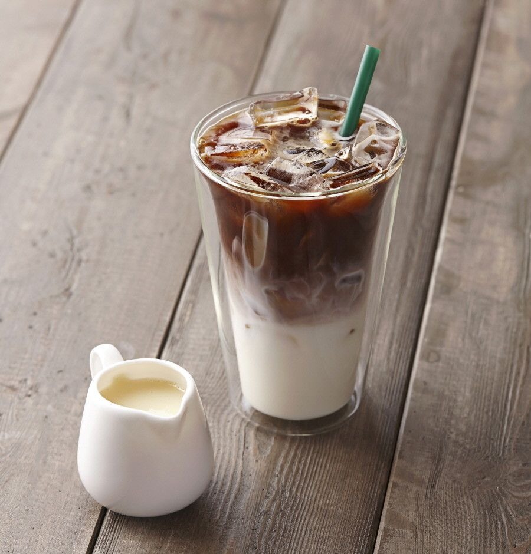
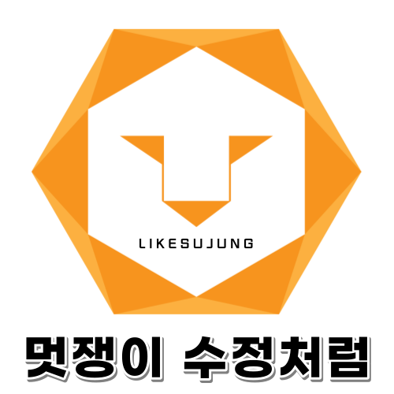
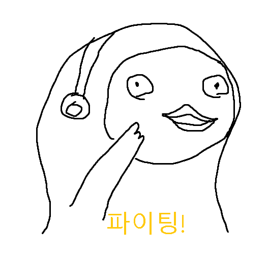
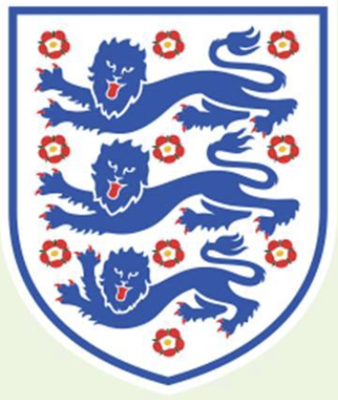

# AI School - 13회차
* 두번째 발걸음 - 팀별 프로젝트
  * 내용 : 팀으로 프로젝트를 수행해 본다.

    파이썬@ 
       <a href='https://www.facebook.com/dongjo.lim.7'>LDJ</a>
    , [임동조](frontierlim13@gmail.com)

<h2><b>멋쟁이 사자처럼 13회-4기</b></h2>

## Notice for Team Project

팀별 프로젝트
* 기간 : 2021.09.17(금) ~ 2021.10.08(금) 
  * STEP 01. 개인 웹 데이터 수집
  * STEP 02. 2021.10.01(금), 중간 발표 
  * STEP 03. 2021.10.08(금), 최종 발표 
    * 최종 분석 제출 : 2021.10.07(목) 22:00
	* 제출 : frontier1020@naver.com

## Reference Documents

##  Team Project : Kick Off

- <b>1st Subject </b>: <b>Analyze Social Issues Using BigData </b>
- <b>Our Motto   </b>: <b> Just Start !! </b>
- <b>Report Format01 </b>: <a href="./docu/최종_프로젝트_수행_계획서_양식.docx">(샘플)프로젝트 수행 계획서 양식</a>
- <b>Report Format02 </b>: <a href="./docu/팀별프로젝트수행_결과작성양식.pptx">(샘플)결과 보고서 양식</a>
- ※ If you click on the image on the right, you can view "Initiation Report" by team.

	<table border=1 bgcolor="#EEEEEE">
		<tr bgcolor="#CC0000">
			<td width="100">
			
<b>Team Name</b>

			</td>
			<td width="100">
			
<b>Team Building</b>

			</td>
			<td width="300">
			
<b>Project Subject</b>

			</td>
			<td width="120">
			
<b>Reports A</b>

			</td>
			<td width="150">
			
<b>Reports B</b>

			</td>
		</tr>
		<tr bgcolor="#CC0000">
			<td>
			
 팀명:돌체라떼  (팀장:박지용)  
				<b></b>
			

			</td>
			<td>
				
 박지용   최두호 

			</td>
			<td>
				
 에너지가격과 국내 가스 수요량(지역난방, 산업가스)에 다른 공급량 예측 

			</td>
			<td>
				
 
				
				

			</td>
			<td>
				
 
				<a href="./reports/최종_프로젝트_수행_계획서(돌체라떼)_2차.pdf">프로젝트 수행계획서</a> 
				<a href="./reports/">중간 발표</a> 
				<a href="./reports/">최종 작품 보기</a> 
				

			</td>
		</tr>
		<tr bgcolor="#CC0000">
			<td>
			
 팀명:멋쟁이 수정처럼 (팀장:문승우)  
				<b></b>
			

			</td>
			<td>
				
문승우 정진우, 오소영, 강수정

			</td>
			<td>
				
 데이콘 - 가스공급량 수요예측 모델개발 대회에 참여 
</td>
			<td>
				
 
				
				

			</td>
			<td>
				
 
				<a href="./reports/최종_프로젝트_수행_계획서(멋쟁이_수정처럼)_2차.pdf">프로젝트 수행계획서</a> 
				<a href="./reports/">중간발표</a> 
				<a href="./reports/">최종 작품 보기</a> 
				

			</td>
		</tr>
		<tr bgcolor="#CC0000">
			<td>
			
 팀명: 으쌰으쌰  (팀장:가채원)  
				<b></b>
			

			</td>
			<td>
				
 가채원   김범중, 김진연, 윤진훈 

			</td>
			<td>
				
 날씨에 따른 가스공급량 수요예측 모델 개발 
</td>
			<td>
				
 
				
				

			</td>
			<td>
				
 
				<a href="./reports/최종_프로젝트_수행_계획서(으쌰으쌰)_2차.pdf">프로젝트 수행계획서</a> 
				<a href="./reports/">중간발표</a> 
				<a href="./reports/">최종 작품 보기</a> 
				

			</td>
		</tr>
		<tr bgcolor="#CC0000">
			<td>
			
 팀명: 삼삼사자  (팀장:이성준)  
				<b></b>
			

			</td>
			<td>
				
 이성준   박승규, 노현곤 

			</td>
			<td>
				
 데이콘 - 가스공급량 수요예측 모델개발 대회 
</td>
			<td>
				
 
				
				

			</td>
			<td>
				
 
				<a href="./reports/최종_프로젝트_수행_계획서(삼삼사자)_2차.pdf">프로젝트 수행계획서</a> 
				<a href="./reports/">중간발표</a> 
				<a href="./reports/">최종 작품 보기</a> 
				

			</td>
		</tr>
		<tr bgcolor="#CC0000">
			<td>
			
 개인별 프로젝트    
				<b></b>
			

			</td>
			<td>
				
 정수빈    

			</td>
			<td>
				
 ___ 
</td>
			<td>
				
 
				
				

			</td>
			<td>
				
 
				<a href="./reports/">프로젝트 수행계획서</a> 
				<a href="./reports/">최종 작품 보기</a> 
				

			</td>
		</tr>	
		<tr bgcolor="#CC0000">
			<td>
			
 개인별 프로젝트    
				<b></b>
			

			</td>
			<td>
				
 전예슬    

			</td>
			<td>
				
 ___ 
</td>
			<td>
				
 
				
				

			</td>
			<td>
				
 
				<a href="./reports/">프로젝트 수행계획서</a> 
				<a href="./reports/">최종 작품 보기</a> 
				

			</td>
		</tr>
	</table>

<ul>
<li><a href="https://ldjwj.github.io/LikeLion_13th_DataCourse/06_team_project02/news/list_index.html">관련 뉴스 링크</a></li>
</ul>

 
### 멋쟁이 사자처럼 실무 데이터 사이언티스트 4기!  최고 멋진 친구들 버전 화이팅!!! ver3 ^^

##  Team Project : Final Report
- <b>Submission   </b>: 결과보고
- <b>Presentation </b>: 10min / team, Q&A
- <b>Keep in mind </b>: <b> Share Lessons Learned !! </b>

 

 &lt; The End &gt; 

